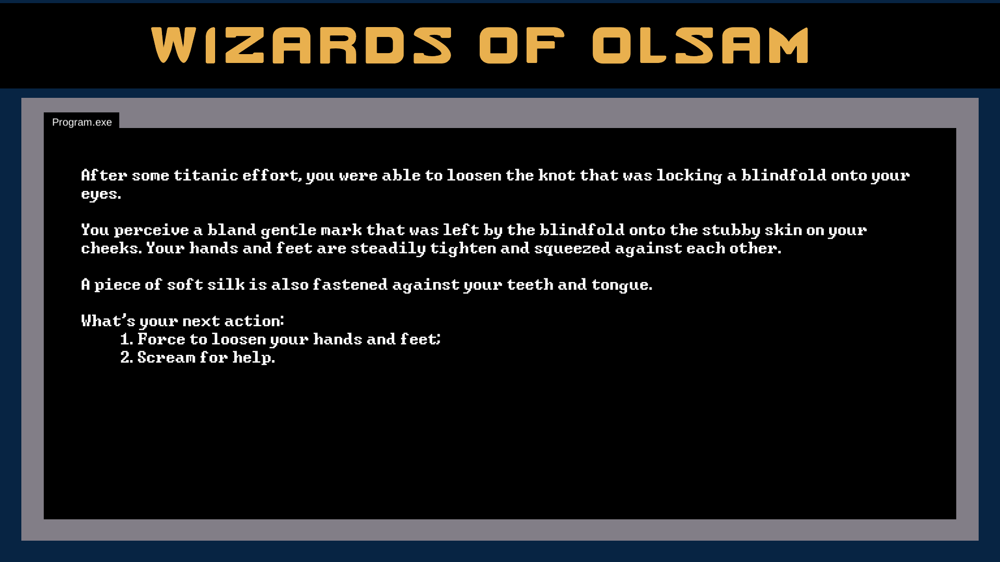
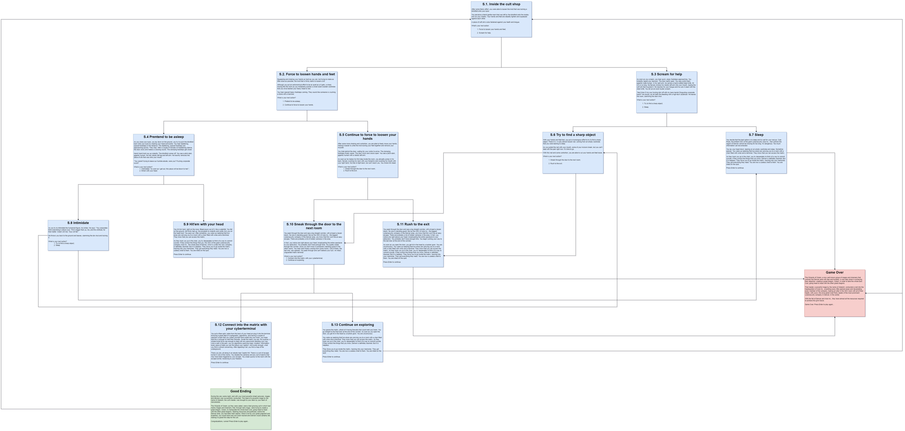

# Wizards of Oslam

A Shadowrun text based game made with Unity [2020.2.7f1](https://unity3d.com/de/unity/whats-new/2020.2.7).

## Table of contents

- [Play the game](#play-the-game)
- [The story](#the-story)
- [States](#states)
    - [S.1 Inside the cult shop](#s1-inside-the-cult-shop)
    - [S.2 Force to loosen hands and feet](#s2-force-to-loosen-hands-and-feet)
    - [S.3 Scream for help](#s3-scream-for-help)
    - [S.4 Pretend to be asleep](#s4-pretend-to-be-asleep)
    - [S.5 Continue to force to loosen your hands](#s5-continue-to-force-to-loosen-your-hands)
    - [S.6 Try to find a sharp object](#s6-try-to-find-a-sharp-object)
    - [S.7 Sleep](#s7-sleep)
    - [S.8 Intimidate](#s8-intimidate)
    - [S.9 Hit'em with your head](#s9-hitem-with-your-head)
    - [S.10 Sneak through the door to the next room](#s10-sneak-through-the-door-to-the-next-room)
    - [S.11 Rush to the exit](#s11-rush-to-the-exit)
    - [S.12 Connect into the matrix with your cyberterminal](#s12-connect-into-the-matrix-with-your-cyberterminal)
    - [S.13 Continue on exploring](#s13-continue-on-exploring)
    - [Good ending](#good-ending)
    - [Game over](#game-over)

## Play the game

A text based game made in Unity. The game is hosted on [itch.io](https://itch.io/) and can be played [here](https://gabrielgibran.itch.io/wizards-of-oslam).

## The story

It will be just a small part of a story, so that I don't waste to much time on a demo game.

It will be about the CEO of a big cyber security company, Asla Inc., that runs the region of Denver in Colorado. 

His name is Cole Pane. He wakes up finding himself captive. His abductors, a cult of a dragon named Oslam worshippers, are demanding security data of the region in exchange for his freedom and integrity.

Knowing a little about neuromancy, Cole finds an opportunity to escape by accessing the matrix and finding out more about his abductors, their final goals with the data, and his current location.

Wrapping up, we have:
1. **The player**: Cole Pane, the CEO;
2. **The situation**: His kidnapping;
3. **The setting**: Denver, Colorado;
4. **The threat**: His death;
5. **The goal**: Escape alive.

## States

The states and flow chart of the game's story were made using app.diagrams.net. The HTML of the flow chart can be found [here](https://github.com/gagibran/wizards-of-oslam/blob/dev/wizards-of-oslam-game-flow.html).

The flow-chart:

### S.1 Inside the cult shop

After some titanic effort, you were able to loosen the knot that was locking a blindfold onto your eyes.

You perceive a bland gentle mark that was left by the blindfold onto the stubby skin on your cheeks. Your hands and feet are steadily tighten and squeezed against each other.

A piece of soft silk is also fastened against your teeth and tongue.

What is your next action?
1. Force to loosen your hands and feet;
2. Scream for help.

### S.2 Force to loosen hands and feet

Squeezing and shaking your hands as hard as you can, but trying to make as little noise as possible, the knot that is firmly starts to loosen a bit.

Although you put an astronomical effort to be as quiet as a it gets, a sharp hissing fills the room as you mistakenly pushes a small sized wooden wardrobe that you once leaned your heavy head to rest.

You hear spaced heavy footsteps coming. They sound like someone is crushing a stone with a hammer.

What is your next action?
1. Pretend to be asleep;
2. Continue to force to loosen your hands.

### S.3 Scream for help

As soon as you scream, you hear quick, angry footsteps approaching. You instantly regret your decision. The door slams open. You see a pitch-dark, gigantic male human. In his right arm, he carries a hand-crafted steel knife, 30 cm or so long. He fiercely shoves his robotic left arm into your mouth, ripping the soft silk that muzzled it. He reaches for your tongue and he cuts it clean with the steel knife. You let out an even louder scream.

"Next time I'll rip your fucking dick off with my bare hands! Disgusting corporate trash!" He shouts, as he halts the bleeding with a high-tech cauterizer. He leaves the room, slamming the door shut.

What is your next action?
1. Try to find a sharp object;
2. Sleep.

### S.4 Pretend to be asleep

As you close your eyes, you lay down on the ground, you try to push the blindfold back onto your eyes by shaking your head awkwardly. The deafening, spaced footsteps are approaching quickly. They stop. After a couple of minutes of maddening silence, the door clicks and makes a cracking sound. The stomping footsteps get closer.

Harsh hand hold you up violently. The blindfold comes off. You see a pitch-dark, gigantic human. He has robotic left leg and left arm. He harshly removes the piece of silk that was onto your mouth.

"You weren't trying to leave our humble abode, were you? Fucking corporate scum!"

What is your next action?
1. (Intimidate) "As soon as I get out, this place will be blown to hell.";
2. Hit'em with your head.

### S.5 Continue to force to loosen your hands

After some more shaking and contortion, you are able to freely move your hands, making it easier to untie the knot locking your feet together and remove your muzzler.

You hide behind the door, waiting for your visitor to arrive. The stomping footsteps finally cease. The door clicks and cracks open. You see a pitch-dark, gigantic human with a robotic left arm.

As soon as he makes his first step inside the room, you abruptly jumps in his back, fiercely crushing his neck with your forearms and covering his mouth with your right hand. He tries to fight back, but can't reach you. You choke him dead.

What is your next action?
1. Sneak through the door to the next room;
2. Rush the corridor of rooms to the exit.

### S.6 Try to find a sharp object

With your hands and feet tied, you put a humongous effort to try to find a sharp object. There it is. A rusty almost loosen nail, coming from an empty wardrobe that you were leaning to sleep.

As you pulled the nail with your mouth, some of your incisors break, but you can't deal with the pain right now. It's time to go.

With this nail and some contortion, you are able to cut your hands and feet loose.

What is your next action?
1. Sneak through the door to the next room;
2. Rush to the exit.

### S.7 Sleep

You decide that the best option is to sleep and to wait for your rescue. Cole Pane, the brilliant CEO of the giant cybersecurity Asla Inc., that controls the region of Denver cannot be missing for too long. It's dangerous. Too much information can be extracted.

You lay your head down, leaning on an empty wardrobe and sleep. Sometime passes. You wake up realizing that two elves are carrying you to a room with a chair filled with wires and a terminal. They know that you can access the matrix.

As they hook you up in the chair, you try desperately to think of a way to commit suicide. If they extract the things that you know, Denver is definitely doomed. But it is helpless. They force you to go inside the matrix, hacking into your memories. They got everything they need. You are now a useless shell to them. You are killed on the spot.

Press Enter to continue.

### S.8 Intimidate

As you try to intimidate the humanoid figure, he smiles. He says: "You corporates think everything is about yous. This's bigger than ya, me, and this shithole, for that matter. Oslam will rise. Yous will fall."

He throws you back to the ground and leaves, slamming the dor shut and locking it.

What is your next action?
1. Try to find a sharp object;
2. Sleep.

### S.9 Hit'em with your head

You hit him hard, right on the nose. Bleed pours out of it, like a waterfall. You fall on the ground, still firmly tied up. He proceeds to violently and coldly kick you on the head hard. You pass out. After sometime, you wake up realizing that two elves are carrying you to a room with a chair filled with wires and a terminal. They know that you can access the matrix.

As they hook you up in the chair, you try desperately to think of a way to commit suicide. If they extract the things that you, the CEO of the giant cybersecurity company Asla Inc., the whole area of Denver, which is under this very company, is definitely doomed. But it is helpless. They force you to go inside the matrix, hacking into your memories. They got everything they need. You are now a useless shell to them. You are killed on the spot.

Press Enter to continue.

### S.10 Sneak through the door to the next room

You peak through the door and see a big straight corridor, with at least a dozen doors. No one is standing guard. But as the CEO of Asla Inc., the biggest cybersecurity company in the Denver area, you know that this won't be an easy escape. There are probably a lot of hidden cameras in the area.

In fact, you notice one right above your head, broadcasting the entire spectacle to your abductors. You probably don't have enough time. You quietly sneak through the corridor, since you don't know if someone's standing guard in the other rooms. You hear load moans coming from some rooms. One of them, the last one, was opened. You peak through and can't believe your luck. An intact, unguarded matrix terminal.

What is your next action?

1. Connect into the matrix with your cyberterminal;
2. Continue on exploring.

### S.11 Rush to the exit

You peak through the door and see a big straight corridor, with at least a dozen doors. No one is standing guard. But as the CEO of Asla Inc., the biggest cybersecurity company in the Denver area, you know that this won't be an easy escape. There are probably a lot of hidden cameras in the area. In fact, you notice one right above your head, broadcasting the entire spectacle to your abductors. You probably don't have enough time. You begin rushing your way to the last door at the end of the corridor.

As soon as you open the door, you get hit in the head by a bulkier goon. You are unconscious. You wake up realizing that two elves are carrying you to a room with a chair filled with wires and a terminal. They know that you can access the matrix. As they hook you up in the chair, you try desperately to think of a way to commit suicide. If they extract the things that you know, Denver is definitely doomed. But it is helpless. They force you to go inside the matrix, hacking into your memories. They got everything they need. You are now a useless shell to them. You are killed on the spot.

Press Enter to continue.

### S.12 Connect into the matrix with your cyberterminal

You pull a fiber-optic cable from the back of your head an plug it into the terminal. Knowing a great deal of cryptography, algorithms, and having a couple of injection scripts that you coded yourself hard-coded into your brain, you hope that this is enough to melt their firewalls. Inside the matrix you are. No surprise, a simple brute force was enough to deal with any passwords standing your way. Like a walk in the park, you run algorithms querying maps, location, information - every piece of data you can find about your captors. And surely enough, what you find is utmost concerning. After digesting it all, you find a map of the underground.

There you are, all along in an abode near Capitol Hill. There is a sort of escape tunnel in one of the rooms. You disable the cameras and any sort of alarms that may have been triggered by your escape. You sneak quickly to the room with the escape tunnel, traversing to your freedom.

Press Enter to continue.

### S.13 Continue on exploring

You ignore the matrix, afraid of it having firewalls that could melt your brain. You go straight to the final door at the end of the corridor. As soon as you open the door, you get hit in the head by a bulkier goon. You are unconscious. 

You wake up realizing that two elves are carrying you to a room with a chair filled with wires and a terminal. They know that you can access the matrix. As they hook you up in the chair, you try desperately to think of a way to commit suicide. If they extract the things that you know, Denver is definitely doomed. But it is helpless. 

They force you to go inside the matrix, hacking into your memories. They got everything they need. You are now a useless shell to them. You are killed on the spot.

Press Enter to continue.

### Good ending

During the very same night, raid with your most powerful street samurais, mages, and deckers was successfully conducted. The head of a powerful mage by the name of Alladuhl, the cult's leader, was brought to your desk by your team of mercenaries.

The Wizards of Oslam, as they were called, were a fast growing cult in which had mainly mages and shamans, that, through dark magic, were trying to create a great dragon, Oslam, to manipulate the whole East Cost, going head to head with the other great dragons. Seeking resources and politically control the Denver area, you had been held captive. Were it not for your great judgment and expertise, you would have had your brain hacked and Denver would certainly fall, making it a great first step for the cult.

Congratulations, runner! Press Enter to play again...

### Game over

The Wizards of Oslam, a now well known group of mages and shamans that controls the Denver area with fear and brutality, is one step closer in achieving their objective: creating a great dragon, Oslam, in order to take the whole East Cost, going head to head with the other great dragons.

Their leader, a powerful mage by the name of Alladuhl, conducted a raid into the headquarters of Asla Inc., exploiting every little opened areas and devastating every member of the company, making an altar in the CEO room with all of their heads, with yours, the once great Cole Pane, leader of the most prominent cybersecurity company in Denver, in the center.

With the fall of Denver and Asla Inc., they have almost all the resources required to achieve this grim future.

Game Over. Press Enter to play again...